# README
This repo is for the data analyst case study for Vertigo Games by Furkan Enes Yalcin.
- The repo contains Pipfiles for setting up an environment for two jupyter notebooks for each task in the case document.
- Also this README.md file itself has the answers to the questions asked and the summary of my findings.
# Setting up the environment and running Notebooks
- First you have to have a python3 (Preferaby 3.13) and [pipenv](https://pipenv.pypa.io/en/latest/) installed.
- Running `pipenv install` at the root of the repository will create a virtual python environment that is needed to run the notebooks.
- Then the command `pipenv run jupyter notebook` runs the jupyter notebook environment.
- After that you can run `task_1.ipynb` or `task_2.ipynb` for checking the work behind the answers to the tasks.

# Questions and Answers
## Task 1
Assume we are running an A/B test on a difficulty flow, and each variant receives
exactly 20,000 installs per day. Write the codes to analyze and create graphics.
### Common works for this task:
- In order to answer the questions, first we need to interpolate the retentions of the each variant. For interpolating this I used [the Power Law Function ](https://www.linkedin.com/pulse/retention-curves-heuristic-approach-russell-ovans-f15qc).  Now we have a interpolated retention curve for each day. 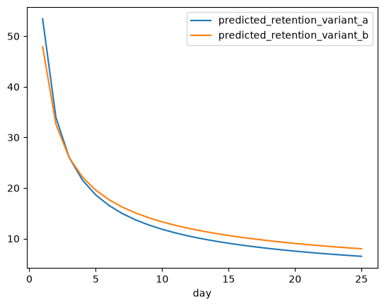
- After that we need to simulate the new user intake (20k daily), then calculate the users and the other metrics using the simulation. Below are the DAU and Cumulative Revenue charts for both variants.
- Simulation is run for 120 days.
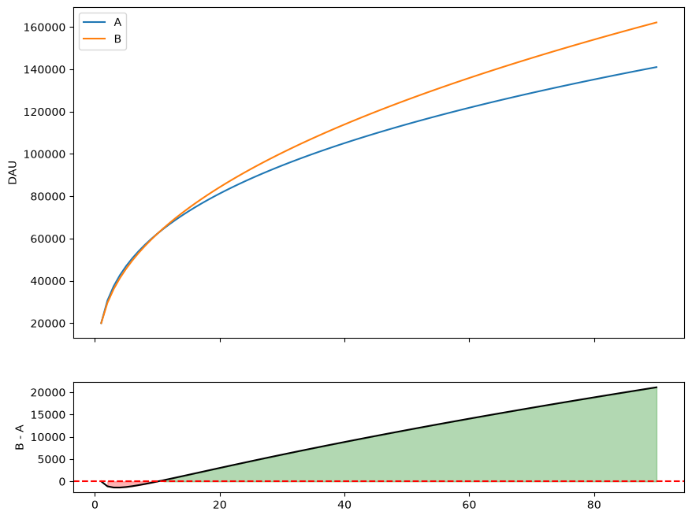
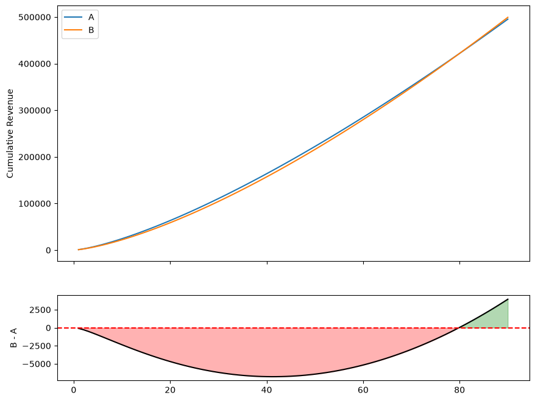
### a) Which variant will have the most daily active users after 15 days?
According to my interpolation **Variant B** will have more DAU by day 15.
| Variant    | Experiment Day 15 DAU |
| -------- | ------- |
| A | 72870 |
| B | 74351 |
### b) Which variant will earn the **most total money** by Day 15?
- Assumptions is `DAU * Daily Purchase Ratio` gives Daily IAP revenue and `(DAU * eCPM * (Ad Impression/DAU) ) /1000)` gives the Ad Revenue.
By Day 15 **Variant A** earn the most total money.
| Variant    | Experiment Day 15 Revenue |
| -------- | ------- |
| A | \$42748.27752  |
| B | \$39140.19396  |
### c) If we look at the **total money earned by Day 30** instead, does our choice change?
No It doesn't change our choice, still **Variant A** has better monetization.
| Variant    | Experiment Day 30 Revenue |
| -------- | ------- |
| A | \$110571.05592  |
| B | \$104381.59032  |
### d) What if we run a 10-day sale starting on Day 15 (boosting everyone's purchase rate by 1%)? Does this change which variant earns more **total money by Day 30**?
(I'm assuming Daily Purchase Ratios for Variant A goes from `0.0305` to `0.0405`. Not a 1% increase like `0.030805`)
After changing the purchases rates from day 15 to day 24, below is the new revenue charts.
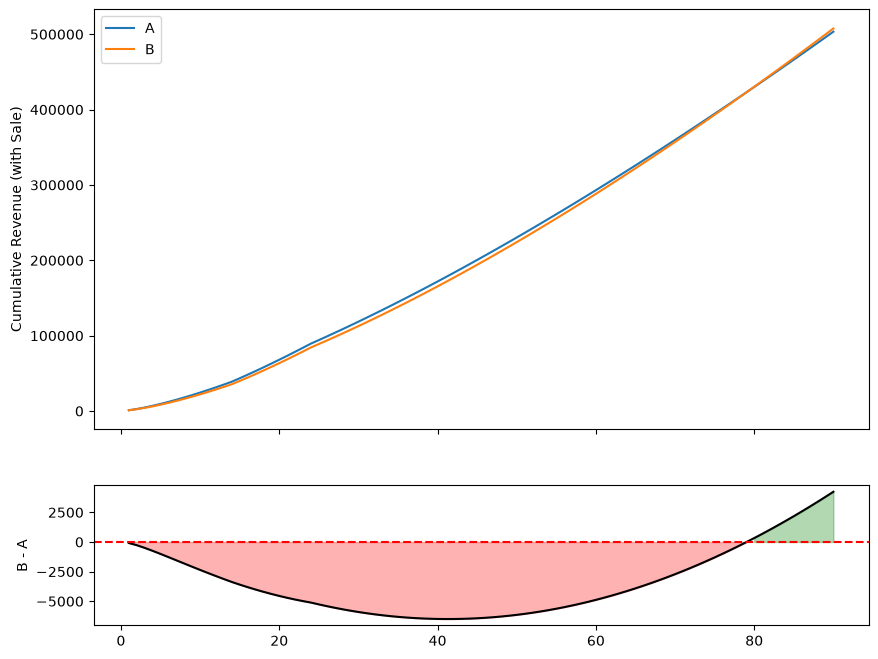
This still doesn't change the result, **Variant A** is better by day 30.
| Variant    | Experiment Day 30 Revenue |
| -------- | ------- |
| A | \$118597.82592  |
| B | \$112694.44032  |

### e) On Day 20 we add a new user source. From then on, we get 12,000 users from the original source and 8,000 from this new one. The new users' retention is described by these formulas. With this mix of old and new users, which variant makes more **total money by Day 30**?
● Variant A (New): $Retention = 0.58 \cdot e^{-0.12(x-1)}$

● Variant B (New): $Retention = 0.52 \cdot e^{-0.10(x-1)}$
I used these functions to create retention rates from day 1 to day 120. And after day 20  I started to use these retentions for the specified part of the cohorts. Below are the charts for the revenue with the new cohort.
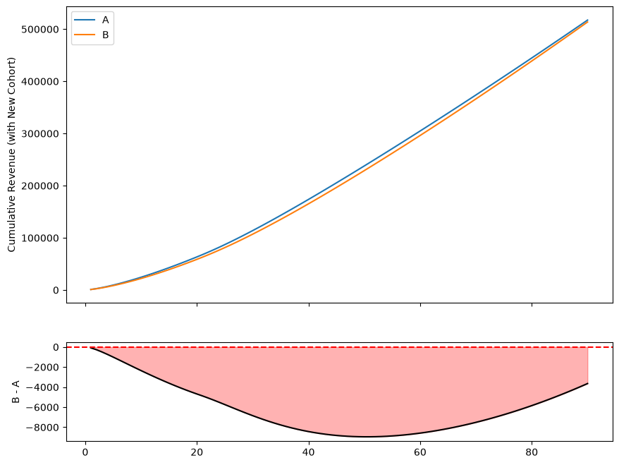
| Variant    | Experiment Day 30 Revenue |
| -------- | ------- |
| A | \$113908.12056  |
| B | \$107062.49034  |

Still **Variant A** is the better one in terms of Day 30 Monetization.
### e) Which one should you prioritize, and why? If you could only make **one** of these improvements:
1. Run the temporary 10-day sale (from d)
2. Add the new, permanent user source (from e/f)

I would choose **the one time sale** because the new user source's long tail retention is way below any industry standard and near zero. And my predicted retention rates is way better in the long term then the new source. (By long term I mean 60 day - 90 day) Of course my predicted retentions of the original test could be wrong but they are way closer to real life expected retentions of casual games. Below are these retentions.

| Source    | Day 30 | Day 60 | Day 90 |
| -------- | ------- | ------- | ------- |
| Original A | 5.64% | 3.62% | 2.79% |
| Original B | 7.09% | 4.86% | 3.89% |
| New Source A | 1.79% | 0.05% | 0.00% |
| New Source B | 2.86% | 0.14% | 0.01% |

## Task 2
Exploratory data analysis on daily user data.
- First I read the data from csv.gz files and put it into pandas dataframe.
- Then I aggregated the data to `user, day` breakdown again because some `user, day` pairs have more than 1 rows.
- I created some metrics and dimensions, such as:
  - Seniority (Grouping of users according to their days since install)
  - 7 Day Rolling Win Rate ( 7 Day Rolling Victory Count / 7 Day Rolling Match Start Count)
  - 7 and 28 Day Rolling Active Days.
  - Playrate (1 for each `user, day` datapoint if a player started or ended a match) (A health indicator)
  - Churner (1 if a user is not active for the followin 7 calendar days)
  - Revenue (Sum of IAP and Ad Revenue)
### Daily First Look
- Let's first investigate the daily data to have a general idea, then look at the same metrics with different dimensions to make additional comments.
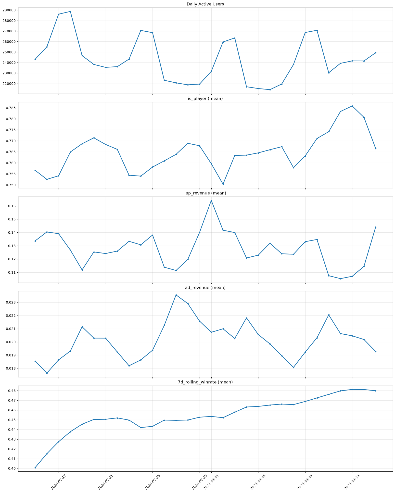
  - Throughout the month we see a weekly pattern of active users as expected.
  - We have a 85% IAP monetized game at our hand.
- Now let's look at different seniorities and how they behave.
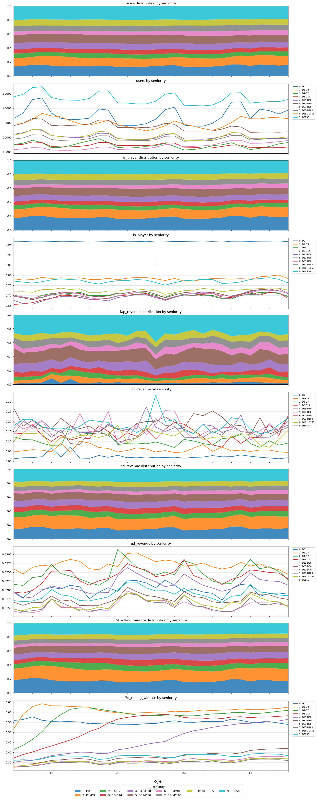
  - We see a higher ad revenue on earlier seniorities but higher iap revenue on later seniorities.
  - 7 Day Rolling Win Rate is generally lower on more mature users.
  - Higher Playrate (is_player mean) usually indicates a healtier game. (Player's can play and engage with the game and tends to generate revenue more) after day 3 we see a drop in playrate which is concerning.
- Let's also quickly look at top 10 countries with the most MAU.
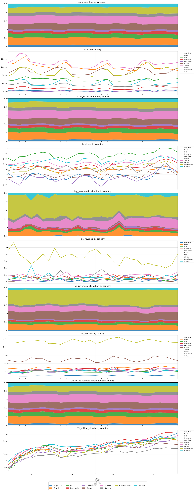
  - USA has clearly the highest daily IAP and Ad revenue amongst the top 10 countries while Russia has significantly higher Ad Revenue compared the others.
### Dimension Analysis
-  We'll look at the aggregation of daily metrics by dimension and investigate the distributions of datapoints.
-  First, take seniority as dimension and look at session duration.
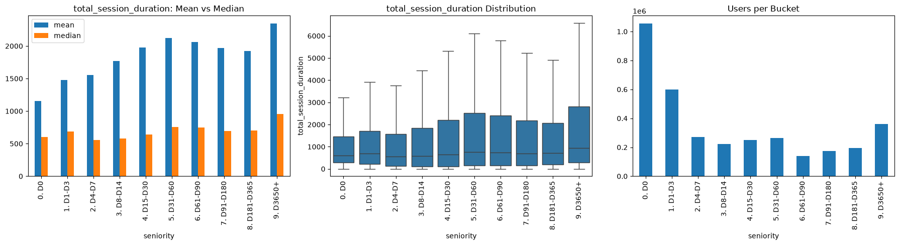
   - We see a increase 'till Day 160 on Total Session Duration and other engagement metrics.
   - A plateau occurs until D365 then an increase starts again.
   - Of course these are also dependent on the acquired users however this perspective can signal a lack of engagement content after Day 160.
- Now look at win rates with the same dimension.
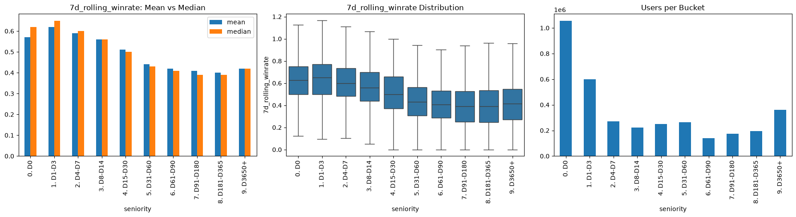
   - We see constant decrease on this metric with seniority.
- Let's also look at the day 7 win rates as a dimension  in order to investigate revenue and active days. Purpose is to find out if the experienced difficulty of the game affects these metrics.
- First Revenue.
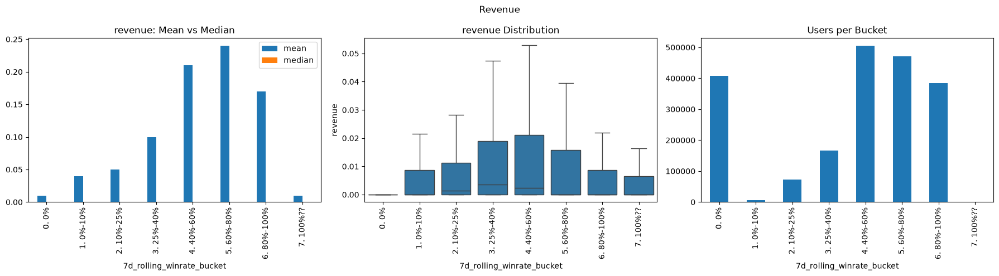
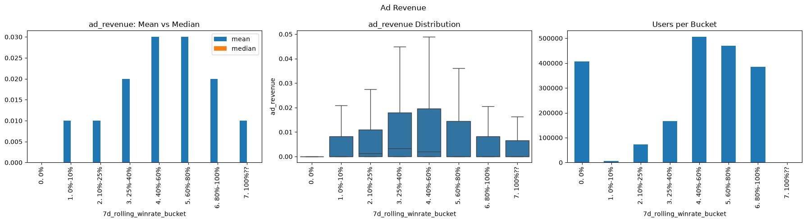
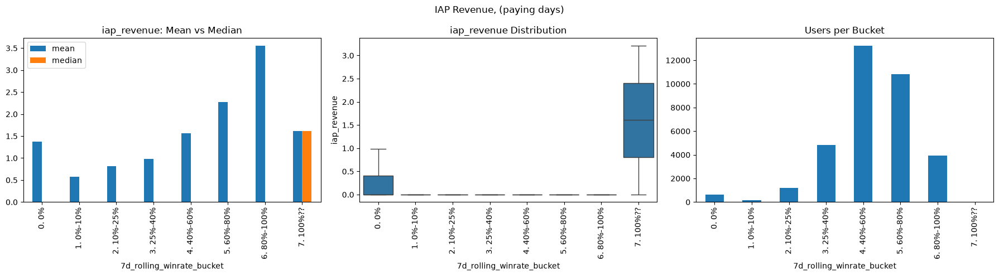
   - It looks like 40%-80% d7 winrate buckets has the better monetization performance however this is highly affected by the ad revenue.
   - In truth, higher win rates have higher iap performance. This suggests me that the game itself is pay to win to a some degree.
- Secondly active days.
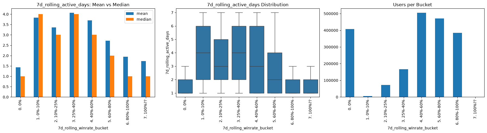
   - This shows me that if the user doesn't struggle enough they don't become active throughout the week.
- Same thing can also be seen in session durations.
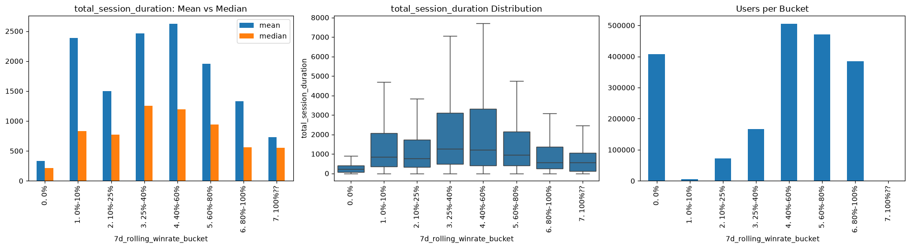
- Check Churns too.
   - Users with 7-14 Seniorities
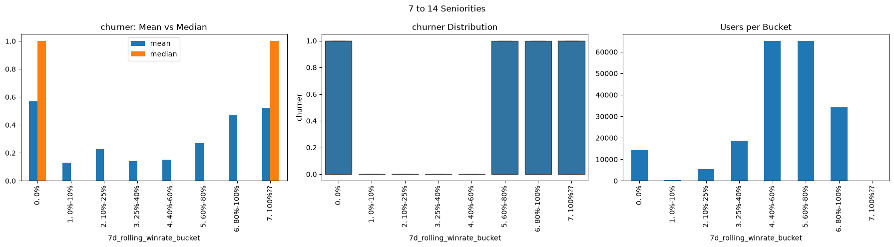
   - Users with 14-89 Seniorities
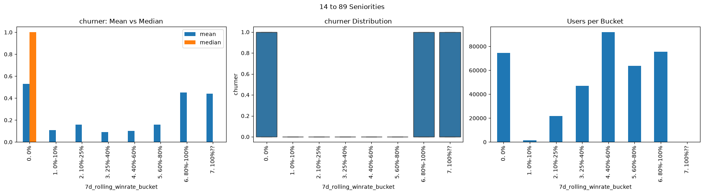
   - Users with 89+ Seniorities
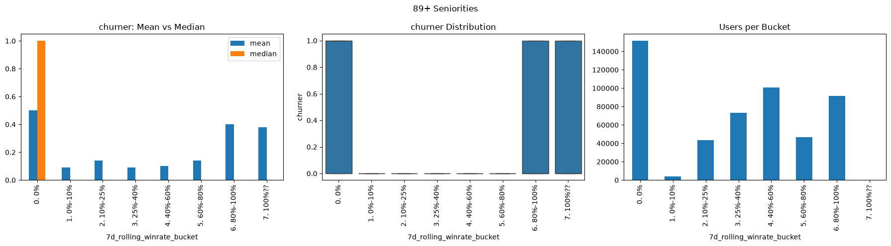
   - At different seniorities we see the same thing, users with too hard and too easy weeks churn significantly more thant the others.
### Quick First Day Check
|                         | Non-Churner | Churner |
|------------------------:|------------:|---------|
|     total_session_count |        1.53 |    1.22 |
|  total_session_duration |     1431.87 |  740.47 |
|       match_start_count |        5.15 |    3.09 |
|         match_end_count |        4.68 |    2.73 |
|           victory_count |        3.56 |    1.89 |
|            defeat_count |        1.12 |    0.84 |
| server_connection_error |        0.05 |    0.07 |
|             iap_revenue |        0.03 |    0.01 |
|              ad_revenue |        0.03 |    0.01 |
|                 revenue |        0.06 |    0.02 |
|                 winrate |        0.61 |    0.50 |

We see significanly lower Session Duration and Win Rate while seeing a little bit higher Server connection error.
Let's look at the box plots for these.
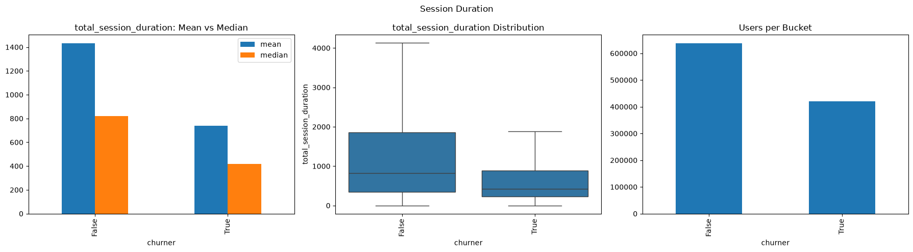
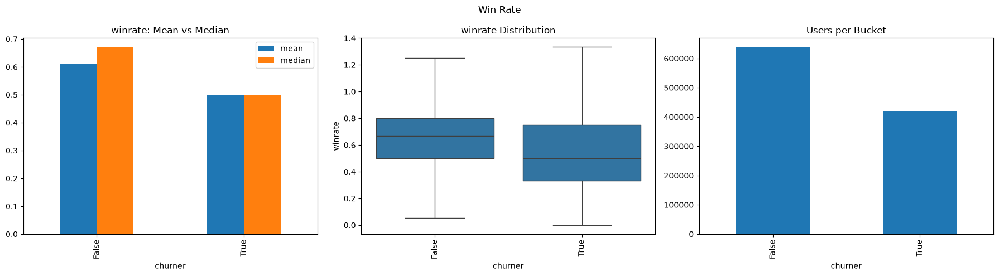
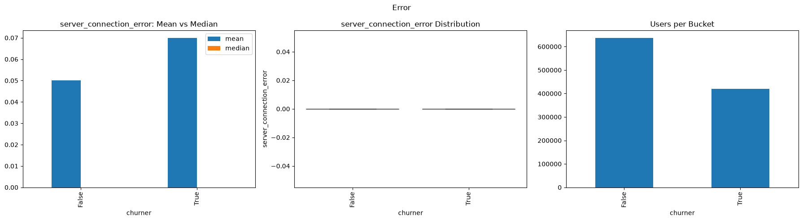
In the light of these plots Session Duration looks like the stronger indicator.
### First week clustering
- I wondered if I can cluster users according to their first week behavior and what can these clusters say about long term behavior of the users.
- I am using a simple K-means model with k=5 (decided with elbow method)
- I am using the following features: ```'total_session_count', 'total_session_duration', 'match_start_count',
       'winrate', 'avg_session_length', 'iap_revenue', 'ad_revenue'```
- Here is the summary of the clusters:

|         | total_session_count | total_session_duration | match_start_count | victory_count | defeat_count | winrate | avg_session_length | iap_revenue | ad_revenue |
|--------:|--------------------:|-----------------------:|------------------:|--------------:|-------------:|--------:|-------------------:|------------:|-----------:|
| cluster |                     |                        |                   |               |              |         |                    |             |            |
|       0 |                5.10 |                5266.29 |             15.24 |         10.03 |         3.39 |    0.70 |            1358.88 |        0.01 |       0.08 |
|       1 |                1.98 |                 938.78 |              3.73 |          2.56 |         0.84 |    0.67 |             529.21 |        0.00 |       0.01 |
|       2 |               17.07 |               30065.91 |             74.64 |         38.81 |        26.10 |    0.55 |            1979.77 |        0.11 |       0.80 |
|       3 |               13.77 |               30520.21 |             75.68 |         49.98 |        20.00 |    0.68 |            2284.83 |       28.45 |       0.98 |
|       4 |                1.38 |                 174.16 |              1.32 |          0.05 |         0.58 |    0.02 |             132.98 |        0.00 |       0.00 |

- With this information I labeled the clusters as the following:
```
      {
        0: "Regular",
        1: "Casual",
        2: "Core F2P",
        3: "Core Payer",
        4: "Abandoned"
    }
```
- Let's look at the daily metrics now. These are found out by mapping the users with their first week clusters throughout the data in hand:
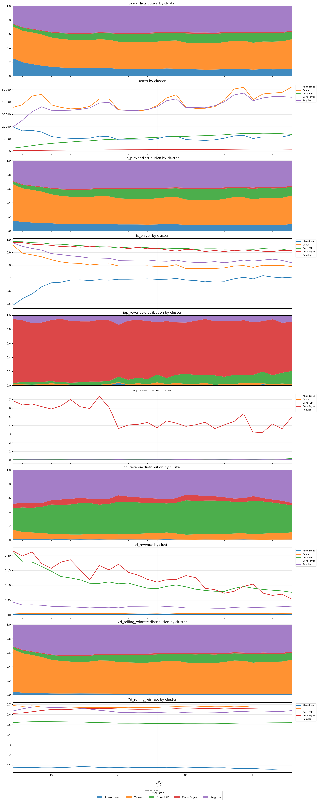
- The huge finding here is according to first week engagement we can determine if a player will be a Core Payer or not.
- Altough Casual players are nearly half of the DAU they don't generate significant ad revenue.
- Of course this is just a one month data, more data is necessary for a better analysis.
  